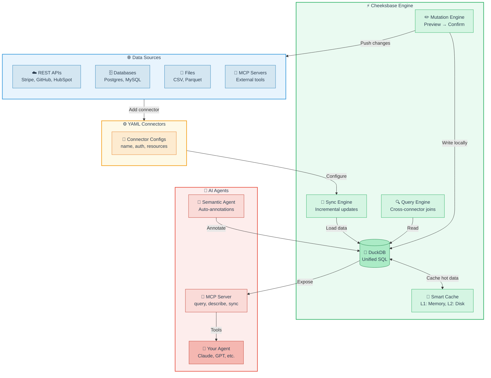

# 🔨 Cheeksbase

**Agent-first data platform with YAML-only connectors.**

Cheeksbase syncs data from APIs, databases, and files into a unified SQL database (DuckDB), making it easy for AI agents to query and write back to your data sources.

## Quick Start

```bash
# Install
pip install cheeksbase

# Initialize
cheeksbase init

# Add a connector
cheeksbase connector add stripe --api-key sk_test_...

# Sync data
cheeksbase sync stripe

# Query
cheeksbase query "SELECT * FROM stripe.customers LIMIT 10"

# Start MCP server
cheeksbase serve
```

## Features

- **YAML-only connectors** - No Python code needed to add new data sources
- **Unified SQL interface** - Query all your data with DuckDB
- **Agent-first design** - Built for AI agents with MCP integration
- **Write-back mutations** - Update source systems via SQL
- **Smart caching** - Multi-layer cache for performance
- **Tool chaining** - Chain MCP tools for complex workflows

## How It Works



### Data Flow

1. **Connect** — Add data sources with YAML configs (no code needed)
2. **Sync** — Incrementally load data into DuckDB
3. **Query** — SQL across all your data with cross-connector joins
4. **Annotate** — Semantic agent adds descriptions and PII flags
5. **Mutate** — Write back to source systems via SQL with preview/confirm
6. **Integrate** — AI agents access everything via MCP tools

## Connectors

Cheeksbase supports multiple connector types:

### REST APIs
```yaml
# connectors/stripe.yaml
name: stripe
type: rest_api
base_url: https://api.stripe.com/v1
auth:
  type: bearer
  token_field: stripe_secret_key
resources:
  - name: customers
    endpoint: /customers
    primary_key: id
  - name: charges
    endpoint: /charges
    primary_key: id
```

### Databases
```yaml
# connectors/postgres.yaml
name: postgres
type: database
connection_string: "{{postgres_url}}"
tables:
  - name: users
    primary_key: id
  - name: orders
    primary_key: id
```

### Files
```yaml
# connectors/csv_data.yaml
name: csv_data
type: file
path: ./data/*.csv
format: csv
```

## MCP Integration

Cheeksbase exposes an MCP server for AI agents:

```python
# Agent can use these tools:
# - query: Execute SQL queries
# - describe: Get table schema and metadata
# - sync: Refresh data from sources
# - annotate: Add semantic annotations
# - chain: Chain multiple tool calls
```

## Development

```bash
git clone https://github.com/DevvGwardo/cheeksbase
cd cheeksbase
pip install -e ".[dev]"
pytest
```

## License

MIT
